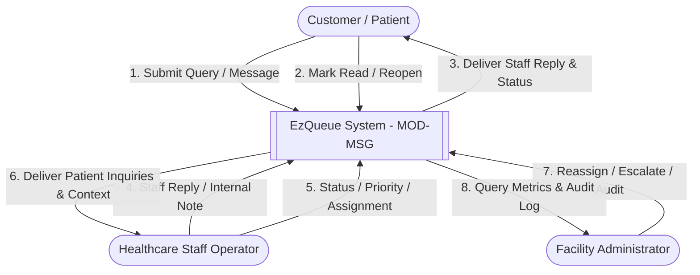
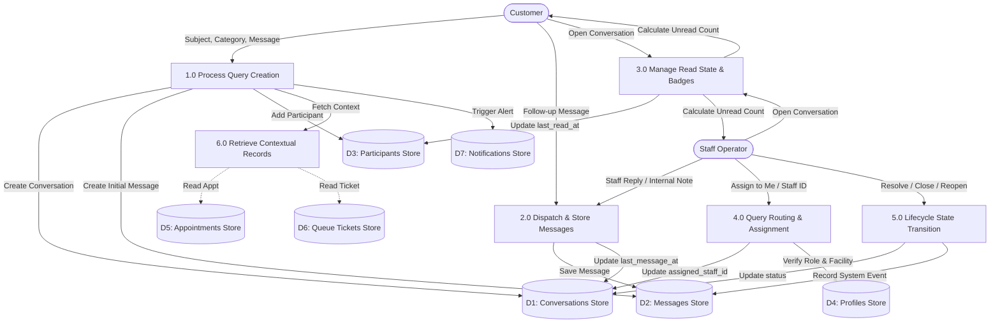

# DATA FLOW DIAGRAMS (DFD)
## MODULE: CUSTOMER QUERY & STAFF MESSAGING (MOD-MSG)

---

### 1. Context Analysis: Level 0 (Context Diagram)

---

### 2. Level 1 DFD: Subsystem Process Decomposition

---

### 3. Detailed Data Dictionary Entries

1. **`Customer_Query_Submission`**:
   `{ customer_id + facility_id + subject + category + initial_content + [appointment_id] + [queue_ticket_id] }`
2. **`Staff_Reply_Submission`**:
   `{ conversation_id + sender_id + staff_role + content + message_type + [reply_to_id] }`
3. **`Internal_Note_Submission`**:
   `{ conversation_id + staff_id + note_content + (message_type = 'INTERNAL_NOTE') }`
4. **`Conversation_State_Update`**:
   `{ conversation_id + actor_id + new_status + timestamp }`
5. **`Read_Receipt_Update`**:
   `{ conversation_id + user_id + read_timestamp }`
