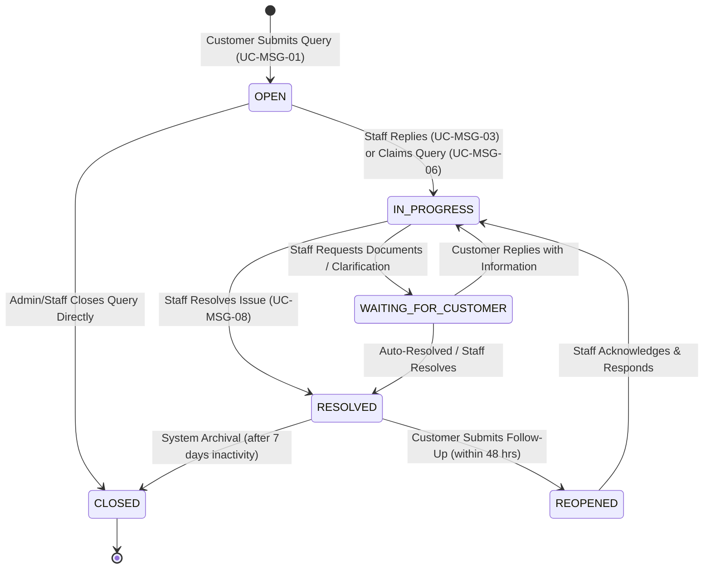
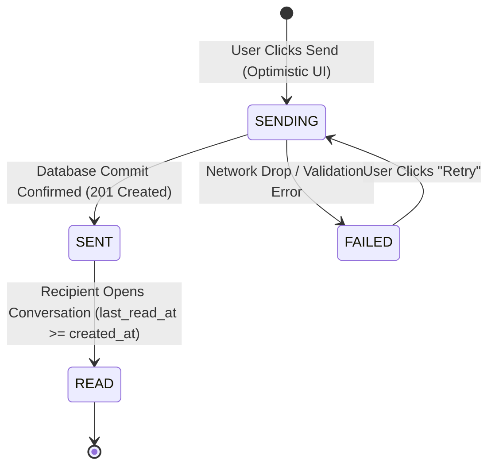

# FINITE STATE MACHINE (FSM) SPECIFICATION
## CONVERSATION & MESSAGE LIFECYCLES (MOD-MSG)

**Document Reference:** FSM-MSG-001  
**Project:** EzQueue Smart Queue Management  

---

### 1. Conversation Lifecycle State Machine

---

### 2. Conversation State Transition Matrix

| Initial State | Target: OPEN | Target: IN_PROGRESS | Target: WAITING | Target: RESOLVED | Target: REOPENED | Target: CLOSED |
| :--- | :---: | :---: | :---: | :---: | :---: | :---: |
| **OPEN** | - | **VALID** (Staff Reply/Claim) | INVALID | **VALID** (Quick Resolve) | INVALID | **VALID** (Spam/Admin) |
| **IN_PROGRESS** | INVALID | - | **VALID** (Ask Info) | **VALID** (Resolution) | INVALID | **VALID** (Force Close) |
| **WAITING_FOR_CUSTOMER** | INVALID | **VALID** (Cust Reply) | - | **VALID** (Resolution) | INVALID | **VALID** (Timeout Close) |
| **RESOLVED** | INVALID | INVALID | INVALID | - | **VALID** (Cust Reply ≤48h) | **VALID** (Archive) |
| **REOPENED** | INVALID | **VALID** (Staff Action) | INVALID | **VALID** (Re-resolve) | - | **VALID** (Admin Close) |
| **CLOSED** | INVALID | INVALID | INVALID | INVALID | INVALID | - |

> [!NOTE]  
> Any transition marked **INVALID** is rejected by the backend API with HTTP `422 Unprocessable Entity` and code `INVALID_STATUS_TRANSITION`.

---

### 3. Message Delivery State Machine

#### Message Status Rules
1. **`SENDING`**: Displayed locally in React UI with a muted clock icon. Message payload is cached in memory.
2. **`SENT`**: Single checkmark ($\checkmark$) displayed. Database has persisted the record with generated UUID and timestamp.
3. **`READ`**: Double checkmark ($\checkmark\checkmark$) or read receipt indicator displayed once recipient's `conversation_participants.last_read_at` moves past the message's `created_at`.
4. **`FAILED`**: Warning icon with explicit "Retry" button. Draft text remains in the composer without data loss.
