# PERT NETWORK ANALYSIS & CRITICAL PATH METHOD (CPM)
## MODULE: CUSTOMER QUERY & STAFF MESSAGING (MOD-MSG)

---

### 1. Three-Point Estimations & Task Durations

Using PERT standard formula:
$$T_e = \frac{O + 4M + P}{6}, \quad \sigma = \frac{P - O}{6}$$
Where $O$ = Optimistic, $M$ = Most Likely, $P$ = Pessimistic duration in days.

| Task Code | Task Description | $O$ (days) | $M$ (days) | $P$ (days) | Expected $T_e$ | Variance $\sigma^2$ | Predecessor |
| :--- | :--- | :---: | :---: | :---: | :---: | :---: | :--- |
| **A** | MSG-01: Requirements & Change Request | 2 | 3 | 5 | **3.17** | 0.25 | None |
| **B** | MSG-02: SRS, UML & System Design Update | 3 | 4 | 7 | **4.33** | 0.44 | A |
| **C** | MSG-03: Supabase Schema & RLS Migration | 2 | 3 | 5 | **3.17** | 0.25 | B |
| **D** | MSG-04: Express API Module & Routing | 4 | 6 | 9 | **6.17** | 0.69 | C |
| **E** | MSG-05: Customer Queries Interface | 3 | 5 | 8 | **5.17** | 0.69 | D |
| **F** | MSG-06: Staff Chat Dual-Pane Workspace | 4 | 6 | 10 | **6.33** | 1.00 | D |
| **G** | MSG-07: Realtime & Unread Engine | 3 | 4 | 7 | **4.33** | 0.44 | E, F |
| **H** | MSG-08: Testing & Regression Suite | 4 | 5 | 8 | **5.33** | 0.44 | G |
| **I** | MSG-09: SQA Audit & RTM Traceability | 2 | 3 | 6 | **3.33** | 0.44 | H |
| **J** | MSG-10: Vercel & Supabase Deployment | 2 | 3 | 5 | **3.17** | 0.25 | I |

---

### 2. PERT Network Diagram

```mermaid
flowchart LR
    Start([Start]) --> A[A: Requirements 3.2d]
    A --> B[B: System Design 4.3d]
    B --> C[C: Database Schema 3.2d]
    C --> D[D: Express API 6.2d]
    D --> E[E: Customer UI 5.2d]
    D --> F[F: Staff Chat 6.3d]
    E --> G[G: Realtime Engine 4.3d]
    F --> G
    G --> H[H: SQA Testing 5.3d]
    H --> I[I: RTM Audit 3.3d]
    I --> J[J: Deployment 3.2d]
    J --> EndNode([Project Done])

    style A fill:#F8F9FA,stroke:#111111,stroke-width:2px
    style B fill:#F8F9FA,stroke:#111111,stroke-width:2px
    style C fill:#F8F9FA,stroke:#111111,stroke-width:2px
    style D fill:#F8F9FA,stroke:#111111,stroke-width:3px
    style F fill:#F8F9FA,stroke:#111111,stroke-width:3px
    style G fill:#F8F9FA,stroke:#111111,stroke-width:3px
    style H fill:#F8F9FA,stroke:#111111,stroke-width:3px
    style I fill:#F8F9FA,stroke:#111111,stroke-width:3px
    style J fill:#F8F9FA,stroke:#111111,stroke-width:3px
```

---

### 3. Critical Path Identification
* **Path 1:** $A \rightarrow B \rightarrow C \rightarrow D \rightarrow E \rightarrow G \rightarrow H \rightarrow I \rightarrow J$
  * Duration: $3.17 + 4.33 + 3.17 + 6.17 + 5.17 + 4.33 + 5.33 + 3.33 + 3.17 = 38.17\text{ days}$
* **Path 2 (Critical Path):** $A \rightarrow B \rightarrow C \rightarrow D \rightarrow \mathbf{F} \rightarrow G \rightarrow H \rightarrow I \rightarrow J$
  * Duration: $3.17 + 4.33 + 3.17 + 6.17 + \mathbf{6.33} + 4.33 + 5.33 + 3.33 + 3.17 = \mathbf{39.33\text{ days}}$
* **Slack Time on Task E (Customer UI):**
  * Total float $TF = 39.33 - 38.17 = 1.16\text{ days}$.
* **Total Project Variance along Critical Path:**
  * $\Sigma \sigma^2 = 0.25 + 0.44 + 0.25 + 0.69 + 1.00 + 0.44 + 0.44 + 0.44 + 0.25 = 4.20$
  * Project Standard Deviation $\sigma = \sqrt{4.20} \approx 2.05\text{ days}$.
