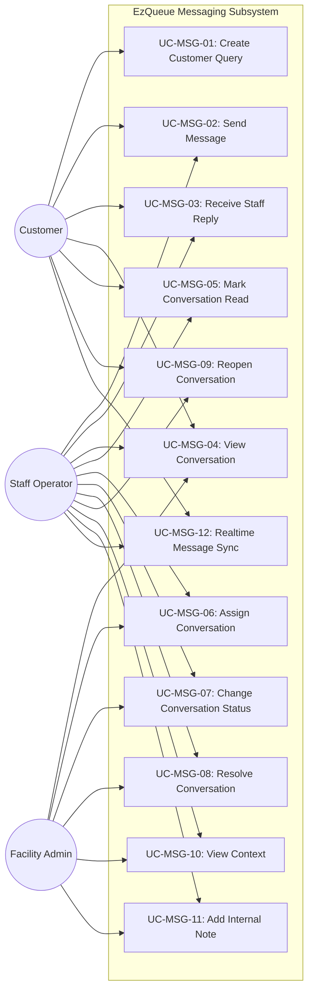
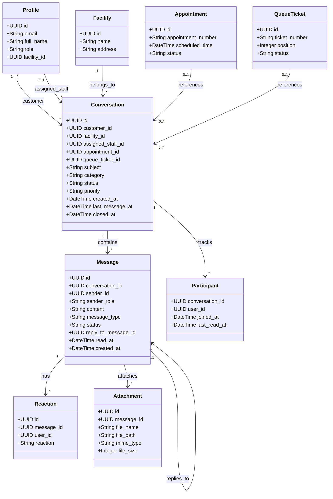
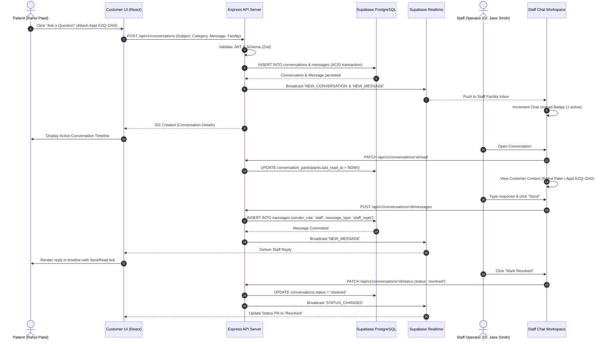

# UML MODELING & DIAGRAMS
## MODULE: CUSTOMER QUERY & STAFF MESSAGING (MOD-MSG)

---

### 1. Use Case Diagram

---

### 2. Domain Class Diagram

---

### 3. Sequence Diagram: End-to-End Query & Staff Response

